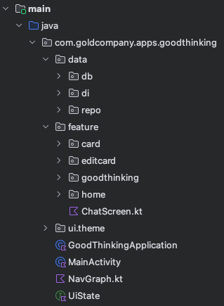

# 좋은 생각 카드

## 개요
동기 부여되는 명언들을 직접 저장하거나 Gemini에게 물어보고 저장할 수 있습니다. 명언을 카드 형식으로 뽑는 재미가 있는 토이 프로젝트입니다.

## 화면
| Main                                    | Gemini                                  | Draw                                    | Edit                                    | Chat                                    |
|-----------------------------------------|-----------------------------------------|-----------------------------------------|-----------------------------------------|-----------------------------------------|
|  |  |  |  |  |

## 프로젝트 구조

## 기술 스택
Android Compose  
Gemini api  
ROOM  
Coroutine Flow  
JUnit4, AndroidJUnit4  
