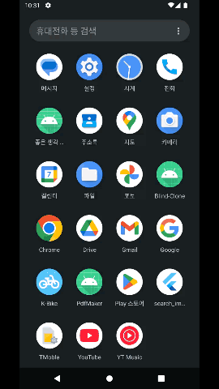
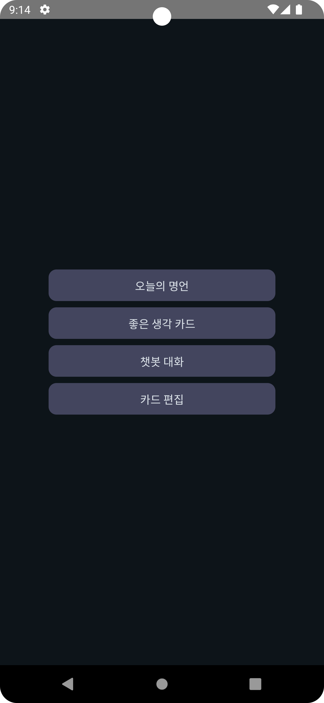
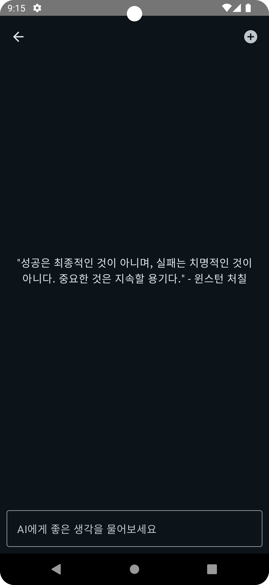
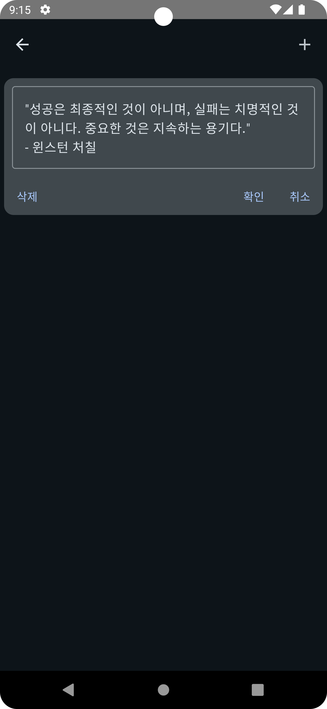
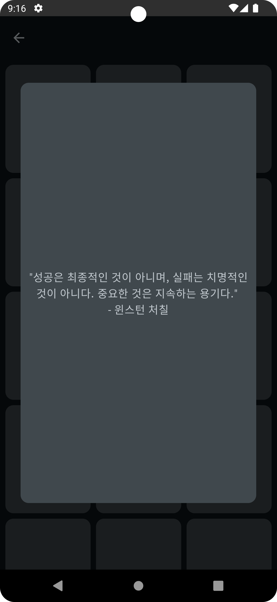
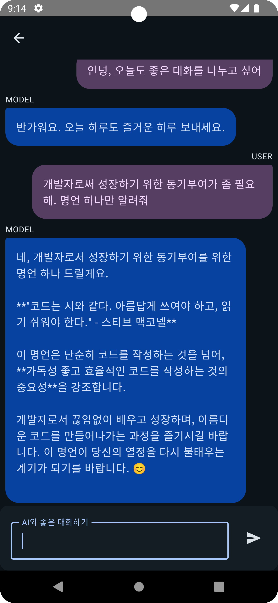

# 좋은 생각 카드
채팅 기능을 구현하고 싶어서 제작한 프로젝트 입니다. Android-Kotlin으로 개발하였습니다.

## 📖 프로젝트 소개
좋은 생각 카드라는 명언 저장 서비스입니다. Gemini API를 두 가지 형태로 활용하였습니다.
하나는 단순한 프롬프트 형식으로 명언을 요청할 수 있으며 반환된 명언을 저장, 수정, 삭제 할 수 있습니다. 저장된 명언은 랜덤 카드 뽑기 형식으로 뽑을 수 있어 유저에게 즐거움을 선사합니다.
다른 하나는 모바일에서 자주 사용하는 형태인 대화형 챗봇 형태로 서비스를 구현하였습니다. 챗봇을 통해 다양한 격려를 받을 수 있습니다.

## 🛠 기술 스택
Language : Kotlin  
View : Compose  
AndroidX : Room, ViewModel, Hilt, AndroidX-Flow-Lifecycle  
Kotlin : Coroutine, StateFlow  
etc : Gemini API, JUnit4  

## ✨ 주요 기능
- 내부 데이터베이스 CRUD (Room 사용)
- MVI 패턴 사용 (Compose - StateFlow)
- 테스트 코드 작성

## 🏞️ 영상

## 🏞️ 화면
| Main                                               | Gemini                                             | Draw                                               | Edit                                               | Chat                                               |
|----------------------------------------------------|----------------------------------------------------|----------------------------------------------------|----------------------------------------------------|----------------------------------------------------|
|  |  |  |  |  |

## 👀 개발 과정에서 발생한 이슈

### 1. 테스트 코드 작성
처음에는 JUnit4를 활용해 간단한 단위 테스트 코드를 작성하려 했습니다. 하지만 프로젝트 환경과 잘 맞지 않아 실행 단계에서 계속 실패가 발생했습니다. 이후 방향을 바꿔 Compose UI Test 라이브러리를 추가해 보았고, 이를 통해 기본적인 UI 동작을 검증하는 테스트 코드를 작성하는 데는 성공했습니다. 여기서 멈추지 않고 Mock 데이터를 직접 만들어 적용해 보니, 단순한 화면 테스트를 넘어 CRUD 기능까지 검증할 수 있는 테스트 코드도 작성할 수 있었습니다. 결과적으로 테스트 환경을 설정하는 과정에서 시행착오가 있었지만, 점차 테스트 범위를 확장하며 프로젝트에 필요한 최소한의 안정성을 확보할 수 있었습니다.

## 🎯 개발 계획
- Chatting 관련 에러 처리
- 테스트 코드 작성
